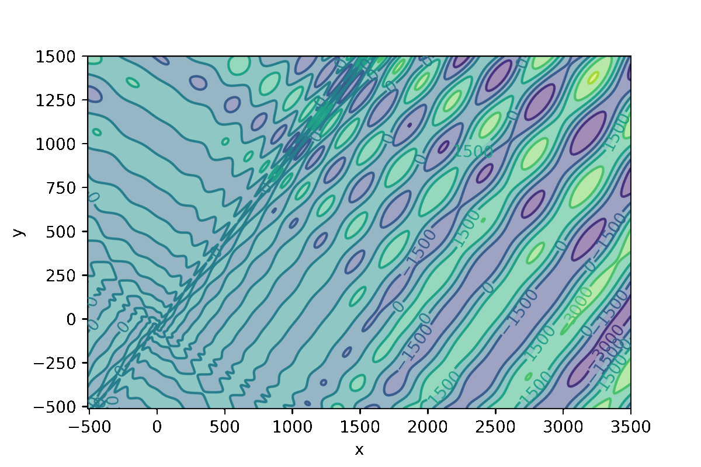
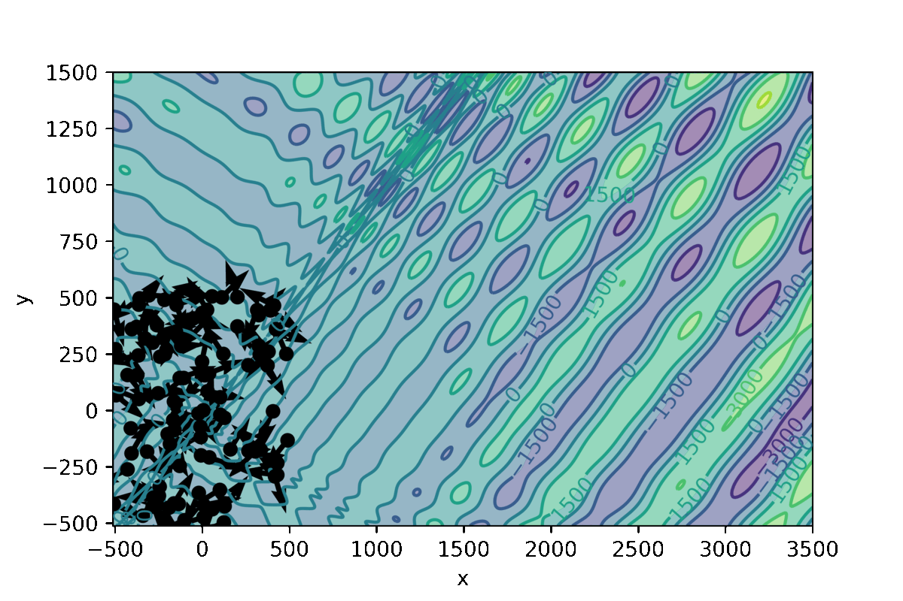
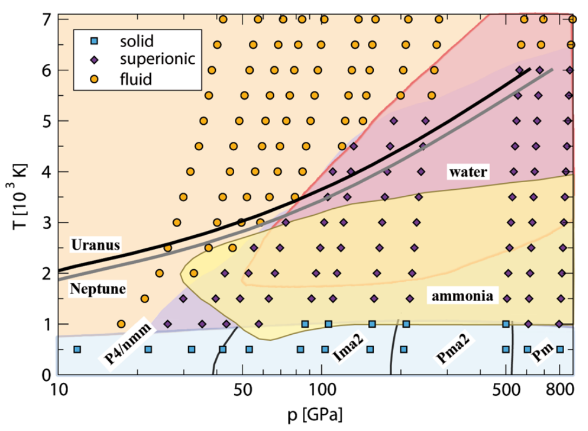
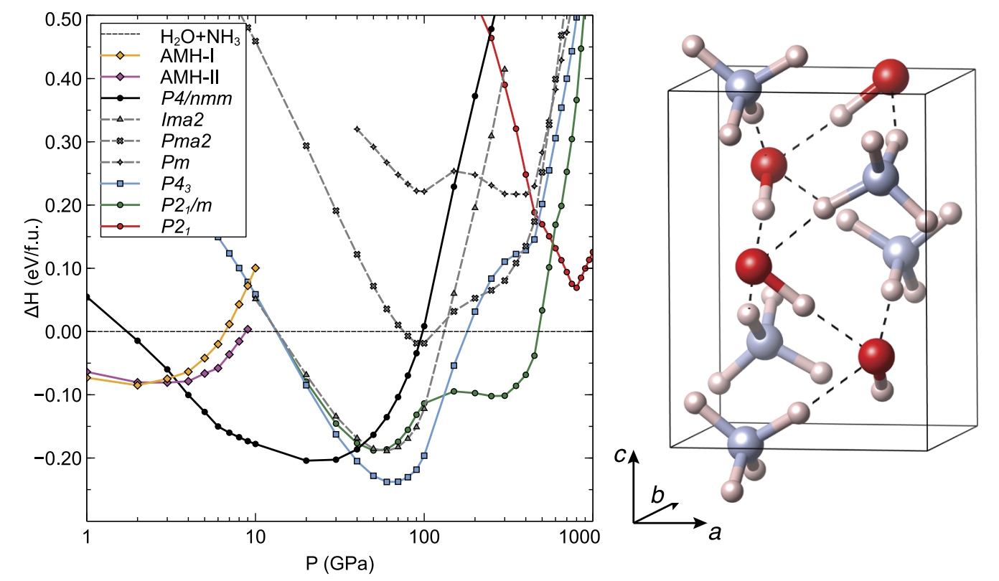

<!-- _class: lead -->

# Bibliographic project
## Generation of optimized structures through Particle Swarm Optimization
**Antoine GISSLER** - Sorbonne Université
January 2023

Repository: <a href="https://github.com/antoinegslr/ParticleSwarmOptimization">https://github.com/antoinegslr/ParticleSwarmOptimization</a>

---

# Introduction

   

## Novel phases in ammonia-water mixtures under pressure
<h3 style="color:gray;">Victor Naden Robinson, Miriam Marqués, Yanchao Wang, Yanming Ma, Andreas Hermann</h3>
 
<h6 style="color:black;">Crystal structure prediction in Saturn and Uranus' mantles</h6>

---
# Introduction

  

Crystal structure prediction requires **sampling** of multiple structures 
**Some existing methods:**
* Monte Carlo
* Simulated annealing
* Minima/basin hopping
* Metadynamics
* Genetic algorithm

**Figure 1:** Eggholder function
(Nathan Rooy on [GitHub](https://github.com/nathanrooy/landscapes))

---
# Introduction

 

**Crystals in Saturn and Uranus:**
* Presence of water ices and ammonia in similar quantities
* High pressures and temperatures

**Problems using previous methods:**
* High computational cost
* High energetic barriers to cross
* Has everything been sampled?
* Everything is unknown

**Figure 2:** Saturn by Hubble telescope
([Nasa](https://solarsystem.nasa.gov/resources/2490/saturns-rings-shine-in-hubble-portrait/?category=planets_saturn), September 2019)

---
<!-- footer: Wang et al., Crystal structure prediction via particle-swarm optimization. *Phys. Rev. B 82* (2010), 094116 -->
# Particle Swarm Optimization (PSO)
 

> Population-based optimization algorithm based on behaviors of birds in a flock

**Figure 3:** Bird flock, by P. D. van de Velde

**Figure 4:** PSO principle, by Wang et al.

$$v_{i,j}^{t+1}=\omega v_{i,j}^t+c_1r_1(\verb+pbest+_{i,j}^t-x_{i,j}^t)+c_2r_2(\verb+gbest+_{i,j}^t-x_{i,j}^t)$$
---
<!-- footer: ""-->
# How does it work?
1. Generation of one random structure per symmetry
2. Local optimization of every structure
3. Exclusion of similar structures *(through bond characterization matrix)*
4. Generation of new structures by PSO, using personal and flock's hystories (global best minimum $\verb+gbest+$ and personnal best minimum $\verb+pbest+$)
5. Repetition of the three last steps until convergence (difference between two consecutive minimal values less than a defined epsilon)
> The program then returns the configuration associated to the lowest energy

---

# Trial over a basic 2D function

**Figure 5:** Global minimum over time

**Figure 6:** Evolution of particles over time

---
<!--footer: Bethkenhagen et al., Superionic phases of the 1:1 water-ammonia mixture. *J. Phys. Chem. A 119* (2015), 10582-10588 -->
# PSO for crystal structure prediction
  

## Results from previous studies
Three stable mixtures were found
* **AMH**  $\small\longrightarrow( \mathrm{H}_2\mathrm{O})(\mathrm{N}\mathrm{H}_3)$
* **ADH** $\small\longrightarrow( \mathrm{H}_2\mathrm{O})_2(\mathrm{N}\mathrm{H}_3)$
* **AHH** $\small\longrightarrow( \mathrm{H}_2\mathrm{O})(\mathrm{N}\mathrm{H}_3)_2$

For each mixture, **various phases** depending on pressure (see Figure)

$\small P4/nmm \overset{38.3}{\rightarrow} Ima2 \overset{149}{\rightarrow} Pma2 \overset{527}{\rightarrow} Pm$

**Figure 7:** Phase diagram determined by Bethkenhagen et al. (using genetic algorithm)

---
<!--footer: Naden Robinson et al., Novel phases in ammonia-water mixtures under pressure. *J. Chem. Phys. 149* (2018), 234501-->
# PSO for crystal structure prediction
  

> Using PSO, authors were able to show that new stuctures might be more stable

**Figure 7:** Relative enthalpies of AMH structures

---
# PSO for crystal structure prediction
 

> Authors also discovered the existence of another mixture : AQH $\footnotesize\longrightarrow( \mathrm{H}_2\mathrm{O})(\mathrm{N}\mathrm{H}_3)_4$

**Figure 8:** AQH-$\small P2_1/m$ structure at 40 GPa

---
# Elaboration of final phase diagram
 

**Figure 9:** Phase diagram for binary ammonia-water mixtures as a function of pressure

---
<!--footer: ""-->
# Conclusion
* Discovery of **a new phase and new stable structures** using Particle Swarm Optimization
* Techniques implemented in the algorithm by Wang et al. (symmetry constraints, bond characterization matrix), make it possible to **reduce the number of iterations**
* PSO seems like a good method for this study case
* But will certainly not become the gold standard
  - Dynamics are not implemented
  - When starting point is given, some techniques might be faster
